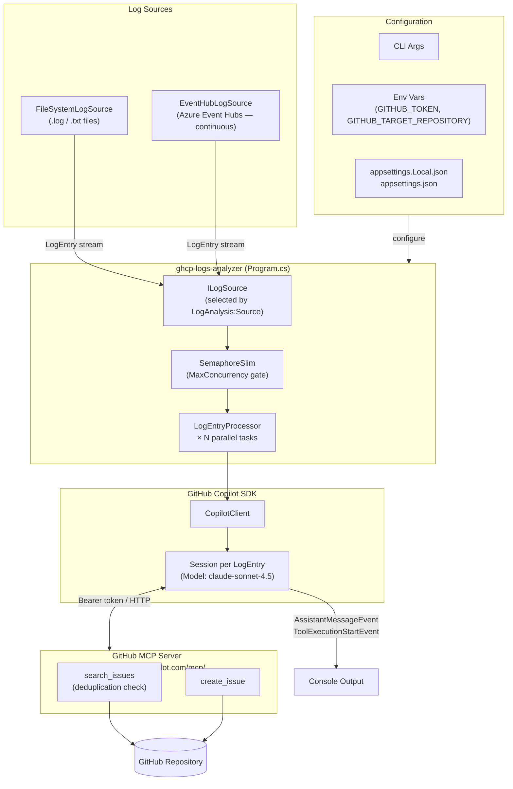

# GitHub Copilot Logs Analyzer

> [!WARNING]
> This project is experimental and under active development. Features may change without notice and the generated workflows should be reviewed carefully before use in production.

A .NET 10 console application that ingests logs, analyzes them with the GitHub Copilot SDK, and creates GitHub issues through the GitHub MCP Server.

🌐 **[Visit the project website →](https://frank802.github.io/ghcp-logs-analyzer/)**

## Features

- Supports multiple log sources:
  - `FileSystem`: scans `.log` and `.txt` files from a folder
  - `EventHub`: continuously reads events from Azure Event Hubs
- Uses AI-powered analysis to identify errors, exceptions, and critical issues
- Automatically creates GitHub issues and attempts to avoid duplicates
- Configurable through `appsettings*.json`, environment variables, and CLI args

## Architecture



## Prerequisites

- [.NET 10 SDK](https://dotnet.microsoft.com/download)
- [GitHub Copilot CLI](https://docs.github.com/en/copilot/github-copilot-in-the-cli) installed and available in `PATH`
- GitHub Copilot subscription
- GitHub Personal Access Token (PAT) with `repo` scope
- For Event Hub mode: an Azure Event Hubs namespace and hub, plus an identity with the **Azure Event Hubs Data Receiver** role (uses `DefaultAzureCredential` — Azure CLI, managed identity, VS login, etc.)

## Installation

```bash
git clone https://github.com/Frank802/ghcp-logs-analyzer.git
cd ghcp-logs-analyzer/src
dotnet restore
dotnet build
```

## Configuration

Create `src/appsettings.Local.json` (git-ignored):

```json
{
  "GitHub": {
    "Token": "ghp_your_personal_access_token",
    "TargetRepository": "owner/repo",
    "Model": "claude-sonnet-4.5"
  },
  "LogAnalysis": {
    "Source": "FileSystem",
    "MinLevel": "Error",
    "MaxConcurrency": 5
  },
  "FileSystem": {
    "LogsFolder": "../sample-logs",
    "SupportedExtensions": [".log", ".txt"]
  },
  "EventHub": {
    "FullyQualifiedNamespace": "<namespace>.servicebus.windows.net",
    "EventHubName": "my-event-hub",
    "ConsumerGroup": "$Default",
    "StartFromEarliest": false
  }
}
```

### Source Selection

- Set `LogAnalysis:Source` to `FileSystem` for folder scanning
- Set `LogAnalysis:Source` to `EventHub` for continuous Event Hub ingestion

### Key Settings

| Setting | Default | Description |
|---|---|---|
| `GitHub:Model` | `claude-sonnet-4.5` | AI model used for analysis |
| `LogAnalysis:MinLevel` | `Error` | Minimum severity to report (`Trace`, `Debug`, `Information`, `Warning`, `Error`, `Critical`) |
| `LogAnalysis:MaxConcurrency` | `5` | Maximum number of log entries processed in parallel |
| `FileSystem:LogsFolder` | `./logs` | Folder to scan in `FileSystem` mode |
| `FileSystem:SupportedExtensions` | `.log,.txt` | Comma-separated file extensions to scan |

### Environment Variables

```powershell
$env:GITHUB_TOKEN = "ghp_your_personal_access_token"
$env:GITHUB_TARGET_REPOSITORY = "owner/repo"
```

## Usage

```bash
# Run from src/
cd src

# Use config values
dotnet run

# Override target repo and logs folder (FileSystem mode)
dotnet run -- <owner/repo> [logs-folder]

# Example (FileSystem)
dotnet run -- Frank802/my-app ../sample-logs
```

Notes:

- In `FileSystem` mode, the optional second CLI argument is the folder path.
- In `EventHub` mode, hub settings are read from `EventHub:*` configuration.
- `EventHub` mode runs continuously until interrupted (Ctrl+C).

## Configuration Priority

1. Command-line arguments
2. Environment variables (`GITHUB_TOKEN`, `GITHUB_TARGET_REPOSITORY`)
3. `appsettings.Local.json`
4. `appsettings.json`

## Running with Docker

### Build

```bash
cd src
docker build -t ghcp-logs-analyzer .
```

### Run (FileSystem source)

```bash
docker run --rm \
  -v /path/to/your/logs:/logs \
  -v ~/.config/github-copilot:/root/.config/github-copilot:ro \
  -e GITHUB_TOKEN=ghp_your_personal_access_token \
  -e GITHUB_TARGET_REPOSITORY=owner/repo \
  ghcp-logs-analyzer owner/repo /logs
```

### Run (EventHub source)

```bash
docker run --rm \
  -v ~/.config/github-copilot:/root/.config/github-copilot:ro \
  -e GITHUB_TOKEN=ghp_your_personal_access_token \
  -e GITHUB_TARGET_REPOSITORY=owner/repo \
  -e LogAnalysis__Source=EventHub \
  -e EventHub__FullyQualifiedNamespace="<namespace>.servicebus.windows.net" \
  -e EventHub__EventHubName="my-event-hub" \
  ghcp-logs-analyzer
```

## How It Works

1. Reads logs from the configured source (`FileSystem` or `EventHub`)
2. Filters entries to the configured minimum severity level (`LogAnalysis:MinLevel`)
3. Dispatches each log entry to a dedicated Copilot session, up to `MaxConcurrency` in parallel
4. Each session analyzes the entry, checks for duplicate issues, then creates a GitHub issue via the GitHub MCP Server
5. Streams assistant output and tool activity to the console

## Project Structure

```
ghcp-logs-analyzer/
├── src/
│   ├── Program.cs              # App entry point and source selection
│   ├── ILogSource.cs           # Log source abstraction + LogEntry record
│   ├── FileSystemLogSource.cs  # Local file-based log source
│   ├── EventHubLogSource.cs    # Azure Event Hubs log source
│   ├── LogEntryProcessor.cs    # Per-entry Copilot session + issue creation
│   ├── appsettings.json        # Default configuration template
│   ├── appsettings.Local.json  # Local secrets/config (git-ignored)
│   ├── Dockerfile              # Docker image definition
│   └── GhcpLogsAnalyzer.csproj # Project file
├── sample-logs/                # Sample file logs for testing
└── README.md
```

## License

MIT
